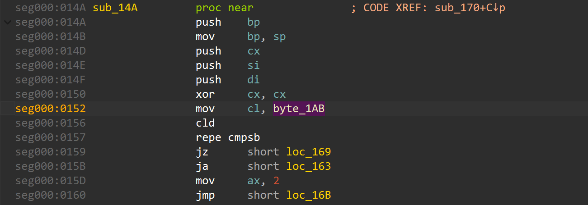

# Sfinky's CrackMe program for Wario

Данная программа создана для ознакомления с возможностью взлома программ через изучение бинарного файла.

Программа запрашивает у пользователя пароль и сверяет его с закодированной строкой. Из-за отсутствия проверок длины вводимых данных существует уязвимость переполнения буфера в `Data`-сегменте

# Окружение
- `x86 16-bit DOS`
- Эмулятор `DosBox`
- Файл формата `.com`
- Ассемблер `TASM`

# Уязвимости

Давайте попробуем определить содержимое памяти.

    
     
    <em>Поиск буфера ввода и эталонного пароля</em>

Заглянув в функцию `CheckPasswordCorrectness` можно найти адреса буфера ввода и эталонного пароля - эти строки в дальнейшем сравниваются в `CompareStrings`. Начала буфера ввода лежит по адресу `18Eh`, а эталонный пароль - по адресу `19Fh`. 

    
     
    <em>Поиск длины эталонного пароля</em>

Заглянув в функцию `CompareStrings` можно заметить, что при сравнении строк используется длина эталонного пароля, она лежит по адресу `1ABh` и равна `12`. Также в функции `Main` можно найти переменную, отвечающую за статус сравнения. Она лежит после буфера ввода по адресу `19Eh` и изначально равна `0`. Таким образом мы определили структуру хранения данных в программе.

В `data`-сегменте (В данном случае это и `code`-сегмент, так как модель установлена `tiny`) выделяется 16 байт под буфер для пользовательского ввода. Кроме того выделяется место для хранения эталонного пароля, его длины, и флага, который отвечает за статус проверки корректности введенного пароля. `Data`-сегмент выглядит следующим образом (Сохранен порядок по возрастанию адресов байтов)

| Адрес (относительный) | Данные | Размер (В байтах) |
| :- | :- | :- |
| `0` | Буфер ввода | `16` |
| `16` | Статус корректности пароля (`0`- пароль некорректен, иначе корректен) | `1`|
| `17` | Эталонный пароль | `12` |
| `29` | Длина пароля (С добавлением единицы на `$`) | `1` |

Функция `ReadInput` читает символы в буфер, пока не встретится символ каретки (`0Dh`). Так как длина ввода не ограничивается, существует две уязвимости:

### 1. Перезапись статуса корректности пароля

Так как переменная, отвечающая за статус корректности пароля находится сразу же после буфера ввода в памяти, то если ввести больше `16` символов, то содержимое по `16` адресу, т.е. статус корректности пароля, может быть перезаписан. Это грозит тем, что функция `CheckPasswordCorrectness` вернет ненулевое значение, и программа выведет, что пароль корректен (При вводе `15` символов в буфер на месте `16` символа будет записан `$`).

### 2. Перезапись эталонного пароля

Так как после буфера ввода и переменной, отвечающей за статус корректности пароля лежит эталонный пароль, ничего не мешает его перезаписать. Мы должны аккуратно заменять содержимое памяти, чтобы не сломать программу. Будем использовать ввод через файл.

    
     
    <em>Создание кряк-файла</em>

 Создадим бинарный файл и заполним его следующим образом:
1. В первых `11` байтах мы записываем новый пароль - тот, который мы захотим. Размер мы выбираем такой, чтобы не менять переменную длины эталонного пароля и сравнение сработало корректно. Пусть новый пароль будет состоять из символов `A`.
2. В `12` байте будет `$` - конец строки. В байтах `13`-`16` могут лежать произвольные данные. 
3. В следующем `17` байте мы должны оставить значение `0`, чтобы не затрагивать первую уязвимость.
4. В байтах `18`-`28` мы запишем новый пароль, как и в первых `11` байтах - он будет состоять из символов `A`.
5. В `29` байт запишем `0Dh` - символ возврата каретки (В памяти на его месте будет стоять `$`).

    
     
    <em>Результат взлома</em>

Запуская программу мы получаем ожидаемый результат - программа выдала `Access granted`

## Выводы

### 1. Отсутствие контроля границ буфера - ошибка

Без контроля границ буфера пользователь может делать что ему вздумается. Изучив бинарник программы можно узнать ее устройство и натворить что угодно.

### 2. Опасно смешивать пользовательские и служебные данные

Из-за того, что буфер ввода и переменная статуса, а также эталонный пароль находились рядом и не было контроля длины ввода, мы смогли изменить поведение программы.

### 3. Логические ошибки опасны

В данной программе плохо реализована логика проверки корректности пароля. Функция, которая валидирует пароль, возвращает `1`, если он корректен и значение локальной переменной в обратном случае. Это опасная реализация. Кроме того, далее пароль считается корректным, если значение не нулевое, хотя должно проверяться, что оно равно `1`. В общем, всегда следует следить за логикой.

### 4. Нужно защищать свою программу

Уязвимостей, конечно, можно придумать очень много, но стараться защищаться от них очень важно.