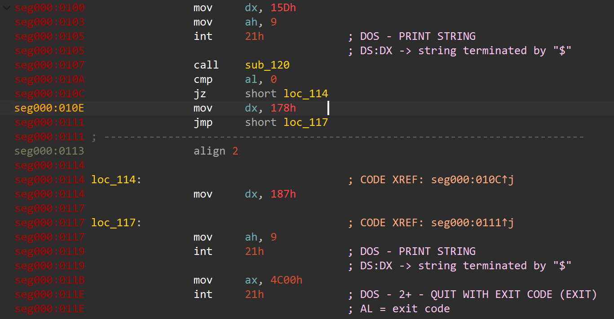
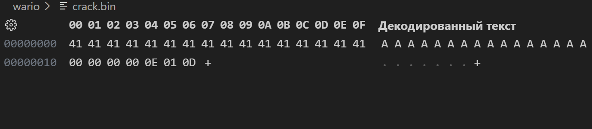
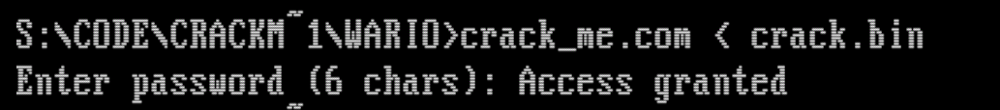

# Wario's CrackMe program for Sfinky

Данная программа создана для ознакомления с возможностью взлома программ через изучение бинарного файла.

Программа запрашивает у пользователя пароль и сверяет его с закодированной строкой. Из-за отсутствия проверок длины вводимых данных существует уязвимость переполнения буфера на стеке.

# Окружение
- `x86 16-bit DOS`
- Эмулятор `DosBox`
- Файл формата `.com`
- Ассемблер `TASM`

# Уязвимости

В функции `check_password` на стеке выделяется `18` байт. Стековый фрейм выглядит следующим образом:

| Смещение | Данные |
| :- | :- |
| `[bp + 2]` | Адрес возврата из функции |
| `[bp + 0]` | Сохраненное значение регистра `bp` |
| `[bp - 2]` | Локальная переменная флага, хранящая статус проверки пароля (`0` - неверно, `1` - верно). |
| `[bp - 18]` | Начало буфера для ввода пароля (`16` байт). |

Функция `my_gets` читает символы в буфер, пока не встретится символ каретки (`0Dh`). Так как длина ввода не ограничивается, существует две уязвимости:

### 1. Перезапись локальной переменной

Так как переменная флага статуса корректности пароля находится сразу же после буфера ввода, то если ввести больше `16` символов, то `17-й` и `18-й` байты, которые содержат переменную, перезапишутся, и тогда функция вернет ненулевое значение, а программа будет считать, что пароль корректен.

### 2. Перезапись адреса возврата

Так как после буфера ввода, переменной флага и сохраненного регистра `bp` лежит адрес возврата, то нет ничего сложного чтобы изменить его.

    
     
    <em>Поиск уязвимости через дизассемблер</em>

С помощью дизассемблера находим адрес, по которому мы бы хотели вернуться из функции `check_password`, чтобы получить надпись `Access granted`. Нам подходит адрес `010Eh`, его мы и будет использовать для подмены.

Так как набрать такой адрес на Ascii-кодах нельзя, будем использовать ввод через файл.

    
     
    <em>Создание кряк-файла</em>

 Создадим бинарный файл и заполним его следующим образом:
1. В первых `16` байтах произвольные данные (Нас не интересует содержимое буфера ввода)
2. В следующих `2` байтах нули, т.к. мы не хотим затрагивать первую уязвимость, а поэтому флаг должен оставаться нулевым
3. Мы `хакеры`, а поэтому испортим сохраняемое значение регистра `bp` из вредности - запишем произвольные данные в следующие после флага `2` байта.
4. В `2` байтах, отвечающих за адрес возврата запишем в обратном порядке байты `01h` и `0Eh`, тем самым подменим адрес возврата.
5. Завершающий байт - символ возврата каретки `0Dh`, который парсится функцией `my_gets`.

    
     
    <em>Результат взлома</em>

Мы получили ожидаемый результат - взлом оказался успешен.

## Выводы

### 1. Отсутствие контроля границ буфера - ошибка

Без контроля границ буфера пользователь может делать что ему вздумается. Изучив бинарник программы можно узнать ее устройство и натворить что угодно.

### 2. Опасно смешивать пользовательские и служебные данные

Из-за того, что буфер ввода и локальная переменная флага хранились рядом с сохраненным значением `bp` и адресом возврата, без контроля длины ввода мы смогли перехватить контроль над процессом выполнения программы.

### 3. Логические ошибки опасны

В данной программе плохо реализована логика проверки корректности пароля. Функция, которая валидирует пароль, возвращает `1`, если он корректен и значение локальной переменной в обратном случае. Это опасная реализация. Кроме того, далее пароль считается корректным, если значение не нулевое, хотя должно проверяться, что оно равно `1`. В общем, всегда следует следить за логикой.

### 4. Нужно защищать свою программу

В данном случае можно было бы хотя бы поставить канарейки, чтобы защититься от неопытного хакера. Но все равно уязвимостей очень много, и мне кажется, что не в любой программе защититься сразу от всех возможно.